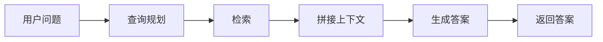
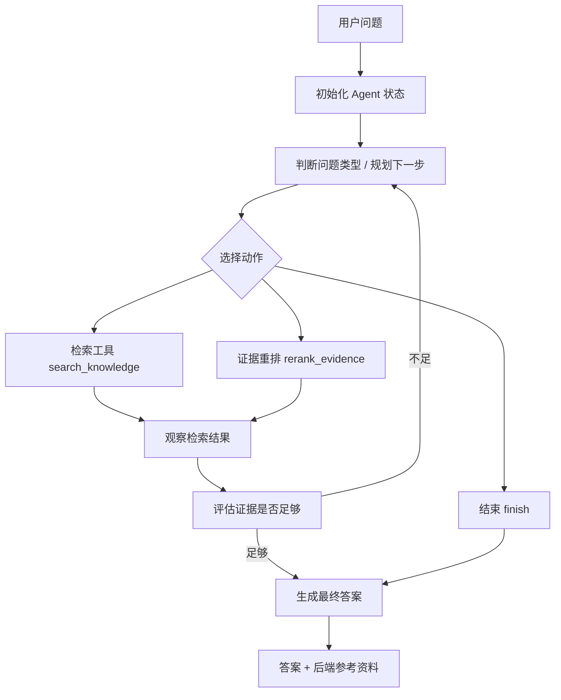
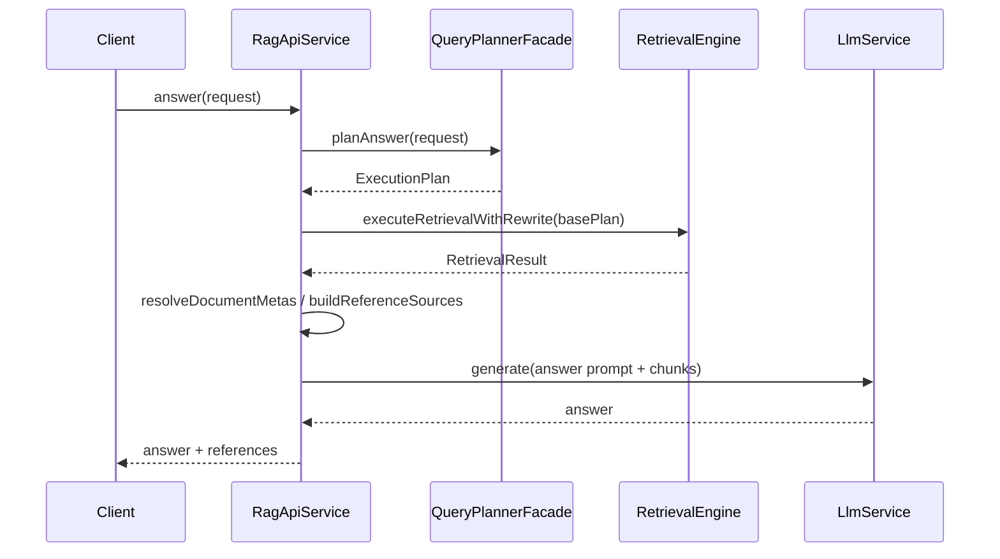
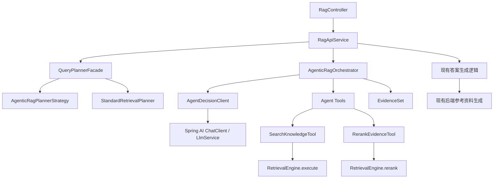
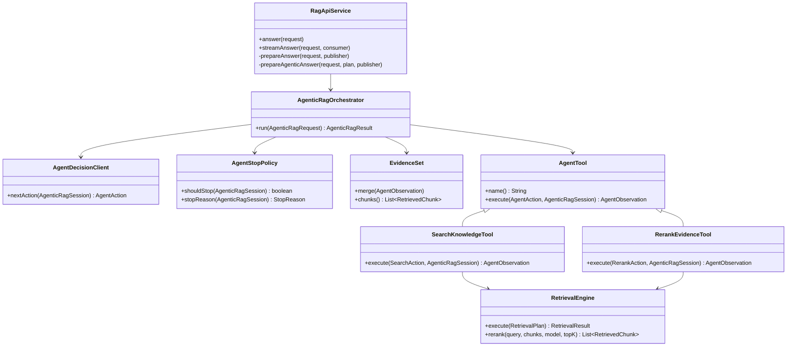
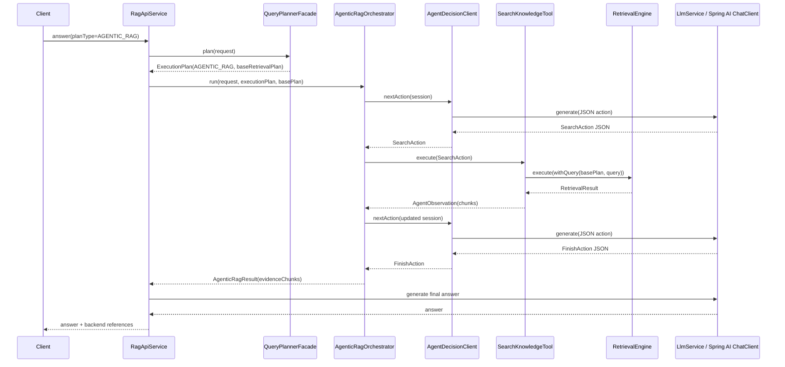

# Agentic RAG 集成方案

## 0. 文档结论

本项目做 Agentic RAG 的推荐路线是：

1. **保留现有 Standard RAG 作为稳定主链路和降级链路。**
2. **新增 Agentic 编排层，保持 `retrieval-engine` 的确定性检索执行职责。**
3. **用 `PlanType.AGENTIC_RAG` 作为入口。**
4. **用 `RetrievalPlan` 作为工具调用的安全边界。**
5. **复用 `RetrievalEngine.execute(...)` 作为 `search_knowledge` 工具。**
6. **复用 `RetrievalEngine.rerank(...)` 作为最终证据重排工具。**
7. **Spring AI 用作 ChatClient、Tool Calling、Advisor、Memory 基础设施，但 Agent 状态机、预算、trace、降级由本项目自己控制。**

首期建设范围聚焦于可验证、可观测、可降级的单 Agent 检索编排能力，核心内容包括：

- Agentic planner
- Agentic orchestrator
- Search tool
- Evidence set
- Final rerank
- Trace / SSE progress
- 降级到 Standard RAG

## 1. 什么是 Agentic RAG

### 1.1 Standard RAG

当前最常见的 Standard RAG 流程是固定流水线：



特点：

- 查询次数通常固定。
- 检索策略通常由代码决定。
- 模型只负责最终答案生成。
- 延迟低、可控性强。
- 对简单事实问题效果好。

问题：

- 多跳问题容易漏查。
- 问题不清晰时无法主动补查。
- 检索结果不足时，模型仍可能强答。
- 很难根据已有证据动态决定下一步。

### 1.2 Agentic RAG

Agentic RAG 把 RAG 从固定流水线变成“模型参与决策的受控循环”：



核心变化：

- 模型不只生成答案，还参与“下一步查什么”。
- 检索可以多轮执行。
- 每轮检索后会根据证据判断是否继续。
- 可以拆解问题、补查遗漏信息、合并证据。
- 需要严格预算和降级，否则成本和延迟容易失控。

### 1.3 Agentic RAG 的基本组件

Agentic RAG 一般包含 6 类组件：

| 组件 | 作用 |
|---|---|
| Planner | 决定是否走 Agentic RAG，生成基础检索计划和预算 |
| Memory | 提供对话上下文，帮助理解追问 |
| Agent State | 保存当前问题、已执行步骤、证据、预算 |
| Tools | 受控工具，如 search、rerank、open document |
| Evidence Store | 合并、去重、筛选检索证据 |
| Final Answer Generator | 基于最终证据生成答案 |

### 1.4 Agentic RAG 适用的问题类型

建议优先对以下问题启用 Agentic RAG：

- 多跳问题：需要从多个资料中组合答案。
- 对比问题：需要查多个对象并比较。
- 归纳问题：需要从多个片段提炼结论。
- 追问问题：当前问题依赖历史上下文。
- 召回不确定问题：第一次检索证据不足，需要补查。

简单事实查询继续使用 `STANDARD_RETRIEVAL`，以保持低延迟和稳定成本；复杂查询按策略路由到 `AGENTIC_RAG`。

### 1.5 最新 RAG 趋势对本项目的启发

近两年的趋势可以简化成 4 点：

1. **RAG Agent 化**
   - LangChain、LlamaIndex 等框架都在把 RAG 从 chain 扩展成 agent + tools。
   - 生产系统通常会保留业务侧状态机、预算和观测控制。

2. **检索工具分层**
   - search、open、find、summarize、rerank 被拆成不同工具。
   - 首期可以先覆盖 search 和 rerank。

3. **证据治理变重要**
   - 多轮检索会引入噪声。
   - 必须做 evidence 去重、重排、压缩、来源保留。

4. **可观测和预算控制是核心**
   - Agentic RAG 的核心风险在于工具调用、成本、延迟和证据质量是否可控。
   - 必须记录每一步 tool call、query、结果数、停止原因、fallback 原因。

## 2. 当前项目现状

### 2.1 项目模块结构

当前项目是多模块架构：

```text
rag-core-common
rag-metadata-cacher
rag-query-planner
rag-retrieval-engine
rag-trace
app
```

模块职责：

| 模块 | 当前职责 | Agentic RAG 中的定位 |
|---|---|---|
| `rag-core-common` | 公共领域模型、服务接口、异常 | 可新增 agentic 公共模型和端口 |
| `rag-metadata-cacher` | 从 Dify 同步知识库、文档、模型元数据 | 继续提供知识库、文档、模型信息 |
| `rag-query-planner` | 生成 `ExecutionPlan` / `RetrievalPlan` | 新增 `AGENTIC_RAG` planner |
| `rag-retrieval-engine` | 执行检索、融合、rerank、LLM adapter | 被 Agentic 工具复用 |
| `rag-trace` | trace sink 和异步记录 | 记录 agent step |
| `app` | API 编排、SSE、异常、答案生成 | 新增 agentic orchestrator 入口 |

### 2.2 当前核心链路

当前问答链路在 `RagApiService.prepareAnswer()` 中完成：



当前已经具备的能力：

- `PlanType` 已经有 `AGENTIC_RAG` 枚举。
- `ExecutionPlan` 已经有 `orchestrationOptions`。
- `RetrievalPlan` 已经能表达 query、知识库、模型、topK、rerank 策略。
- `RetrievalEngine.execute(...)` 已经能执行完整检索。
- `RetrievalEngine.rerank(...)` 已经能对 chunk 列表重排。
- `RagApiService` 已经有 query rewrite、多 query 并行检索、merge、final rerank 的部分逻辑。
- `RagProcessEventPublisher` 已经支持阶段事件和 SSE。
- 参考资料已经由后端统一生成，模型不再生成 URL。

这些都是做 Agentic RAG 的基础。

### 2.3 当前 planner 状态

`PlanType`：

```java
public enum PlanType {
    STANDARD_RETRIEVAL,
    AGENTIC_RAG
}
```

但当前只有 `StandardRetrievalPlanner` 实现：

```java
class StandardRetrievalPlanner implements PlannerStrategy {
    @Override
    public PlanType planType() {
        return PlanType.STANDARD_RETRIEVAL;
    }
}
```

所以当前如果传 `AGENTIC_RAG`，`DefaultQueryPlannerFacade` 会找不到对应 planner，最终报不支持。

### 2.4 当前 retrieval-engine 状态

`RetrievalEngine` 当前接口：

```java
public interface RetrievalEngine {
    RetrievalResult execute(RetrievalPlan plan);

    default RetrievalResult execute(RetrievalPlan plan, RagProcessEventPublisher eventPublisher) {
        return execute(plan);
    }

    List<RetrievedChunk> rerank(
            String query,
            List<RetrievedChunk> chunks,
            ModelEndpointSpec rerankModel,
            int topK
    );

    default List<RetrievedChunk> rerank(
            String query,
            List<RetrievedChunk> chunks,
            ModelEndpointSpec rerankModel,
            int topK,
            RagProcessEventPublisher eventPublisher,
            String scope
    ) {
        return rerank(query, chunks, rerankModel, topK);
    }
}
```

这两个方法正好对应 Agentic RAG 的两个核心工具：

- `execute` -> `search_knowledge`
- `rerank` -> `rerank_evidence`

### 2.5 当前 Spring AI 状态

项目已经集成 Spring AI：

- 父 `pom.xml` 使用 `spring-ai-bom`，版本为 `1.0.0`。
- `rag-retrieval-engine` 依赖：
  - `spring-ai-openai`
  - `spring-ai-rag`
  - `spring-ai-starter-model-chat-memory-repository-jdbc`
- 当前代码已经使用：
  - `ChatClient`
  - `Advisor`
  - `RetrievalAugmentationAdvisor`
  - `DocumentRetriever`
  - `ChatMemoryRepository`
  - `SpringAiChatCompletionAdapter`
  - `MultiKnowledgeBaseDocumentRetriever`

设计结论：

| Spring AI 能力 | 本项目是否使用 | 建议 |
|---|---|---|
| `ChatClient` | 使用 | 用于 agent 决策、证据评估、最终答案 |
| Tool Calling | 第二阶段使用 | 先项目自控 JSON action，稳定后包装 Spring AI tools |
| Advisor | 有选择使用 | 继续用于 memory；Agentic 主循环由业务编排层控制 |
| `RetrievalAugmentationAdvisor` | 谨慎使用 | 适合标准 RAG，不作为 Agentic RAG 首期主体 |
| Chat Memory | 使用 | 用于追问理解，不保存所有 agent 内部步骤 |

一句话：**Spring AI 作为基础设施，Agentic 状态机由本项目自己实现。**

## 3. 本项目如何集成 Agentic RAG

### 3.1 需要实现哪几个小模块

本项目集成 Agentic RAG，采用模块化编排方式，将规划、决策、工具执行、证据治理、停止策略和观测拆分为独立组件，便于测试、替换和灰度。

总体架构如下：

新增 Agentic 编排层：



核心原则：

- `query-planner` 决定边界。
- `agentic orchestrator` 决定步骤。
- `retrieval-engine` 只执行检索。
- `app` 继续统一生成最终答案和参考资料。

#### 3.1.1 `RagApiService` 分支改造

当前 `prepareAnswer()` 是标准链路。建议在 `RagApiService` 内增加 Agentic RAG 分支，函数原型如下：

```java
PreparedAnswer prepareAnswer(RagAnswerRequest request, RagProcessEventPublisher publisher)

PreparedAnswer prepareStandardAnswer(
        RagAnswerRequest request,
        ExecutionPlan plan,
        RagProcessEventPublisher publisher)

PreparedAnswer prepareAgenticAnswer(
        RagAnswerRequest request,
        ExecutionPlan plan,
        RagProcessEventPublisher publisher)
```

`prepareAnswer` 输入输出：

| 项 | 类型 | 说明 |
| --- | --- | --- |
| 输入 | `RagAnswerRequest` | 用户问题、知识库范围、模型参数、会话参数 |
| 输入 | `RagProcessEventPublisher` | SSE 事件发布器 |
| 输出 | `PreparedAnswer` | 统一承载检索结果、LLM 请求、参考资料 |

`prepareAnswer` 伪代码：

```text
plan = planAnswer(request)

if plan.planType == AGENTIC_RAG:
    return prepareAgenticAnswer(request, plan, publisher)

return prepareStandardAnswer(request, plan, publisher)
```

`prepareAgenticAnswer` 输入输出：

| 项 | 类型 | 说明 |
| --- | --- | --- |
| 输入 | `RagAnswerRequest` | 原始请求 |
| 输入 | `ExecutionPlan` | planner 产出的执行计划，包含 base `RetrievalPlan` |
| 输入 | `RagProcessEventPublisher` | 用于输出 agent step、tool call、retrieval trace |
| 输出 | `PreparedAnswer` | 后续答案生成所需的统一上下文 |

`prepareAgenticAnswer` 伪代码：

```text
memoryContext = resolveMemory(request)
basePlan = plan.primaryRetrievalPlan

agenticResult = agenticOrchestrator.run(
    originalQuery = request.query,
    executionPlan = plan,
    baseRetrievalPlan = basePlan,
    conversationId = memoryContext.conversationId,
    publisher = publisher
)

evidenceChunks = agenticResult.evidenceChunks
documentMetas = resolveDocumentMetas(evidenceChunks)
referenceSources = buildReferenceSources(evidenceChunks, documentMetas)

llmModel = resolveLlmModel(request)
llmRequest = buildFinalAnswerRequest(
    plan = plan,
    request = request,
    evidenceChunks = evidenceChunks,
    documentMetas = documentMetas,
    referenceSources = referenceSources,
    memoryContext = memoryContext
)

return PreparedAnswer(
    executionPlan = plan,
    retrievalResult = toRetrievalResult(agenticResult),
    llmModel = llmModel,
    llmRequest = llmRequest,
    referenceSources = referenceSources
)
```

#### 3.1.2 模块清单

首期建议实现 8 个小模块：

```text
1. Agentic Planner
2. Agentic Orchestrator
3. Agent Decision Client
4. Agent Memory Adapter
5. Agent Tools
6. Evidence Store
7. Agent Stop Policy
8. Agent Trace / SSE Events
```

#### 3.1.3 Agentic Planner

职责：

- 支持 `PlanType.AGENTIC_RAG`。
- 复用标准 planner 的知识库、模型、rerank 解析逻辑。
- 生成 base `RetrievalPlan`。
- 在 `orchestrationOptions` 中写入 agent 预算。

边界：

- LLM 决策由 `AgentDecisionClient` 承担。
- 检索执行由工具层调用 `RetrievalEngine` 完成。
- 单步检索 query 的动态决策由 orchestrator 驱动。

#### 3.1.4 Agentic Orchestrator

职责：

- 控制 agent loop。
- 调用决策模型。
- 执行工具。
- 更新 evidence。
- 判断停止。
- 输出最终证据。

边界：

- 底层存储访问统一经由 `RetrievalEngine`。
- 参考资料继续由 `RagApiService` 后端生成。
- 检索工具执行严格基于 planner 生成的 base `RetrievalPlan`。

#### 3.1.5 Agent Decision Client

职责：

- 调用 LLM 生成下一步动作。
- 解析结构化 JSON。
- 失败时重试或降级。

实现方式：

- 首期：复用现有 `LlmService`，要求模型输出 JSON。
- 后续阶段：用 Spring AI Tool Calling 包装工具。

#### 3.1.6 Agent Memory Adapter

职责：

- 提供最近用户问题。
- 帮助 agent 理解追问。

复用：

- 现有 `ConversationMemoryService.recentUserMessages(...)`。
- 现有 Spring AI JDBC memory。

边界：

- agent observation 进入 trace，不进入用户对话 memory。
- 用户对话 memory 仅保存面向用户的会话信息。

#### 3.1.7 Agent Tools

首期覆盖两个工具：

| 工具 | 复用能力 | 说明 |
|---|---|---|
| `search_knowledge` | `RetrievalEngine.execute` | 根据 query 检索 |
| `rerank_evidence` | `RetrievalEngine.rerank` | 对多轮证据最终重排 |

后续再增加：

- `open_document`
- `find_in_document`
- `summarize_evidence`

#### 3.1.8 Evidence Store

职责：

- 按 `chunkId` 去重。
- 保存每个 chunk 命中的 query。
- 保存 firstSeenStep。
- 保存最高分。
- 输出最终 evidence chunks。

#### 3.1.9 Agent Stop Policy

职责：

- 控制停止条件。
- 防止 agent 无限循环。

停止条件：

- 达到 `maxSteps`。
- 达到 `maxSearchCalls`。
- 达到 `maxTotalMs`。
- 证据足够。
- 连续空检索。
- LLM 决策为 finish。

#### 3.1.10 Agent Trace / SSE Events

职责：

- 记录 agent step。
- 让流式接口能展示“正在分析 / 正在检索 / 已找到资料”。

事件示例：

```json
{
  "stage": "AGENT_STEP",
  "status": "RUNNING",
  "details": {
    "stepIndex": 2,
    "action": "search_knowledge",
    "query": "交易保证金调整规则",
    "purpose": "补充适用条件"
  }
}
```

### 3.2 各个小模块需要增加什么，原型是什么

#### 3.2.1 包结构建议

首期可以先放在 `app` 模块，减少模块调整：

```text
app/src/main/java/com/cffex/rag/app/agentic/
  AgenticRagOrchestrator.java
  AgenticRagRequest.java
  AgenticRagResult.java
  AgenticRagSession.java
  AgentDecisionClient.java
  AgentDecisionPromptBuilder.java
  AgentActionParser.java
  AgentStopPolicy.java
  EvidenceSet.java
  EvidenceItem.java
  tool/
    AgentTool.java
    SearchKnowledgeTool.java
    RerankEvidenceTool.java
```

稳定后可以抽成：

```text
rag-agentic-orchestrator
```

#### 3.2.2 数据模型原型

数据对象原型只定义字段、输入输出和约束，不在方案中给出实现代码。

#### `AgenticRagRequest`

| 字段 | 类型 | 必填 | 说明 |
| --- | --- | --- | --- |
| `originalQuery` | `String` | 是 | 用户原始问题 |
| `executionPlan` | `ExecutionPlan` | 是 | planner 输出的执行计划 |
| `baseRetrievalPlan` | `RetrievalPlan` | 是 | 标准检索链路生成的基础检索计划 |
| `conversationId` | `String` | 否 | 会话 ID，用于记忆和 trace 关联 |
| `eventPublisher` | `RagProcessEventPublisher` | 是 | SSE 事件发布器 |

输入格式示意：

```text
AgenticRagRequest(
    originalQuery,
    executionPlan,
    baseRetrievalPlan,
    conversationId,
    eventPublisher
)
```

#### `AgenticRagResult`

| 字段 | 类型 | 必填 | 说明 |
| --- | --- | --- | --- |
| `requestId` | `String` | 是 | 本次 Agentic RAG 请求 ID |
| `evidenceChunks` | `List<RetrievedChunk>` | 是 | 最终交给答案生成链路的证据片段 |
| `steps` | `List<AgentStep>` | 是 | agent 执行步骤 |
| `stopReason` | `StopReason` | 是 | 停止原因 |
| `debugTrace` | `Map<String, Object>` | 否 | 调试信息，不进入最终答案 |

输出格式示意：

```text
AgenticRagResult(
    requestId,
    evidenceChunks,
    steps,
    stopReason,
    debugTrace
)
```

#### `AgenticRagSession`

| 字段 | 类型 | 说明 |
| --- | --- | --- |
| `sessionId` | `String` | agent 单次运行 ID |
| `originalQuery` | `String` | 用户原始问题 |
| `basePlan` | `RetrievalPlan` | 继承标准链路的检索计划 |
| `budget` | `AgentBudget` | 本次运行预算 |
| `steps` | `List<AgentStep>` | 已执行步骤 |
| `evidenceSet` | `EvidenceSet` | 去重后的候选证据集合 |
| `startedAtMs` | `long` | 开始时间 |
| `stopReason` | `StopReason` | 当前停止原因 |

状态更新伪代码：

```text
addStep(step):
    steps.append(step)
    evidenceSet.merge(step.observation)
    update counters and trace
```

#### `AgentBudget`

| 字段 | 类型 | 说明 |
| --- | --- | --- |
| `maxSteps` | `int` | 最大 agent 步数 |
| `maxSearchCalls` | `int` | 最大知识库检索次数 |
| `evidenceTopK` | `int` | 最终保留证据数 |
| `maxTotalMs` | `long` | 最大总耗时 |
| `fallbackToStandard` | `boolean` | agent 失败时是否回退标准 RAG |

#### `AgentStep`

| 字段 | 类型 | 说明 |
| --- | --- | --- |
| `index` | `int` | 第几步 |
| `action` | `AgentAction` | 本步动作 |
| `observation` | `AgentObservation` | 工具执行结果 |
| `elapsedMs` | `long` | 本步耗时 |

#### `AgentAction`

| 字段 | 类型 | 说明 |
| --- | --- | --- |
| `action` | `String` | 动作类型：`search_knowledge`、`rerank_evidence`、`finish` |
| `query` | `String` | 检索动作使用的 query |
| `purpose` | `String` | 本次动作目标 |
| `topK` | `int` | 重排或截断数量 |
| `reason` | `String` | 决策理由 |

输入 JSON 格式：

```json
{
  "action": "search_knowledge",
  "query": "交易保证金调整规则 适用条件",
  "purpose": "补充适用条件",
  "topK": 8,
  "reason": "已有证据只说明调整方式，缺少适用范围"
}
```

#### `AgentObservation`

| 字段 | 类型 | 说明 |
| --- | --- | --- |
| `toolName` | `String` | 工具名 |
| `success` | `boolean` | 工具执行是否成功 |
| `chunks` | `List<RetrievedChunk>` | 工具产出的证据片段 |
| `message` | `String` | 工具执行摘要 |
| `metadata` | `Map<String, Object>` | query、耗时、requestId、错误码等结构化信息 |

输出 JSON 格式：

```json
{
  "toolName": "search_knowledge",
  "success": true,
  "chunks": ["RetrievedChunk..."],
  "message": "检索完成",
  "metadata": {
    "query": "交易保证金调整规则 适用条件",
    "resultCount": 6,
    "requestId": "..."
  }
}
```

#### `EvidenceSet`

| 字段 | 类型 | 说明 |
| --- | --- | --- |
| `items` | `Map<String, EvidenceItem>` | 按 chunkId 去重后的证据集合 |

合并规则伪代码：

```text
merge(observation):
    for each chunk in observation.chunks:
        key = chunk.chunkId
        if key not exists:
            add EvidenceItem from chunk
        else:
            merge matchedQueries
            keep the higher score
            keep the earlier firstSeenStep
```

#### `EvidenceItem`

| 字段 | 类型 | 说明 |
| --- | --- | --- |
| `chunk` | `RetrievedChunk` | 证据片段 |
| `matchedQueries` | `Set<String>` | 命中过该片段的检索 query |
| `firstSeenStep` | `int` | 首次出现步骤 |
| `bestScore` | `double` | 该片段最高分 |

#### `StopReason`

| 值 | 说明 |
| --- | --- |
| `EVIDENCE_SUFFICIENT` | 证据充分 |
| `FINISH_ACTION` | LLM 决策结束 |
| `MAX_STEPS_REACHED` | 达到最大步数 |
| `MAX_SEARCH_CALLS_REACHED` | 达到最大检索次数 |
| `TIMEOUT` | 达到最大耗时 |
| `EMPTY_RESULTS` | 多次检索无有效证据 |
| `LLM_DECISION_FAILED` | 决策输出无法解析或调用失败 |
| `FALLBACK_TO_STANDARD` | 回退标准 RAG |

#### 3.2.3 类图



#### 3.2.4 函数签名原型和伪代码

#### `AgenticRagOrchestrator`

函数签名原型：

```java
AgenticRagResult run(AgenticRagRequest request)

AgentObservation executeAction(AgentAction action, AgenticRagSession session)
```

输入输出：

| 函数 | 输入 | 输出 | 说明 |
| --- | --- | --- | --- |
| `run` | `AgenticRagRequest` | `AgenticRagResult` | 执行 agent 循环，输出最终证据 |
| `executeAction` | `AgentAction`, `AgenticRagSession` | `AgentObservation` | 按动作类型调用具体工具 |

伪代码：

```text
run(request):
    session = createSession(request)

    while stopPolicy.shouldStop(session) == false:
        action = decisionClient.nextAction(session)

        if action.type == "finish":
            session.stopReason = FINISH_ACTION
            break

        observation = executeAction(action, session)
        step = buildStep(session.nextStepIndex, action, observation)
        session.addStep(step)

    finalEvidence = evidenceSelector.selectFinalEvidence(session)

    return AgenticRagResult(
        requestId = session.sessionId,
        evidenceChunks = finalEvidence,
        steps = session.steps,
        stopReason = session.stopReason,
        debugTrace = session.debugTrace
    )
```

#### `AgentDecisionClient`

函数签名原型：

```java
AgentAction nextAction(AgenticRagSession session)

LlmRequest buildDecisionRequest(AgenticRagSession session)

AgentAction parseDecision(String llmContent)
```

输入输出：

| 函数 | 输入 | 输出 | 说明 |
| --- | --- | --- | --- |
| `nextAction` | `AgenticRagSession` | `AgentAction` | 调用 LLM 并解析下一步动作 |
| `buildDecisionRequest` | `AgenticRagSession` | `LlmRequest` | 构造决策 prompt |
| `parseDecision` | `String` | `AgentAction` | 解析固定 JSON 动作协议 |

伪代码：

```text
nextAction(session):
    llmRequest = buildDecisionRequest(session)
    llmResponse = llmService.generate(llmRequest)
    return parseDecision(llmResponse.content)
```

首期继续使用 `LlmService`，因为它已经由 `SpringAiChatCompletionAdapter` 实现，底层仍然走 Spring AI `ChatClient`。

#### `SearchKnowledgeTool`

函数签名原型：

```java
AgentObservation execute(SearchAction action, AgenticRagSession session)

RetrievalPlan rewriteQuery(RetrievalPlan basePlan, String query)
```

输入输出：

| 函数 | 输入 | 输出 | 说明 |
| --- | --- | --- | --- |
| `execute` | `SearchAction`, `AgenticRagSession` | `AgentObservation` | 执行一次知识库检索 |
| `rewriteQuery` | `RetrievalPlan`, `String` | `RetrievalPlan` | 只替换 query，其他检索约束继承 base plan |

伪代码：

```text
execute(action, session):
    plan = rewriteQuery(session.basePlan, action.query)
    retrievalResult = retrievalEngine.execute(plan, session.eventPublisher)

    return AgentObservation(
        toolName = "search_knowledge",
        success = true,
        chunks = retrievalResult.chunks,
        message = "检索完成",
        metadata = {
            query,
            resultCount,
            requestId
        }
    )
```

注意：这里只替换 query；知识库、docIds、模型和认证信息均继承自 base `RetrievalPlan`。

#### `RerankEvidenceTool`

函数签名原型：

```java
List<RetrievedChunk> selectFinalEvidence(AgenticRagSession session)

List<RetrievedChunk> rerankEvidence(
        String query,
        List<RetrievedChunk> chunks,
        int topK,
        AgenticRagSession session)
```

输入输出：

| 函数 | 输入 | 输出 | 说明 |
| --- | --- | --- | --- |
| `selectFinalEvidence` | `AgenticRagSession` | `List<RetrievedChunk>` | 从累计证据中选出最终证据 |
| `rerankEvidence` | `query`, `chunks`, `topK`, `session` | `List<RetrievedChunk>` | 复用 `retrieval-engine` 的重排能力 |

伪代码：

```text
selectFinalEvidence(session):
    chunks = session.evidenceSet.chunks
    rerankModel = extractRerankModel(session.basePlan)

    if chunks is empty:
        return empty list

    if rerankModel exists:
        return retrievalEngine.rerank(
            query = session.originalQuery,
            chunks = chunks,
            model = rerankModel,
            topK = session.budget.evidenceTopK,
            publisher = session.eventPublisher,
            stage = "agentic_final"
        )

    return sortByScoreDesc(chunks).take(session.budget.evidenceTopK)
```

#### `AgentStopPolicy`

函数签名原型：

```java
boolean shouldStop(AgenticRagSession session)

StopReason resolveStopReason(AgenticRagSession session)
```

输入输出：

| 函数 | 输入 | 输出 | 说明 |
| --- | --- | --- | --- |
| `shouldStop` | `AgenticRagSession` | `boolean` | 判断是否停止 agent 循环 |
| `resolveStopReason` | `AgenticRagSession` | `StopReason` | 返回停止原因 |

伪代码：

```text
shouldStop(session):
    if session.steps.size >= session.budget.maxSteps:
        session.stopReason = MAX_STEPS_REACHED
        return true

    if session.searchCallCount >= session.budget.maxSearchCalls:
        session.stopReason = MAX_SEARCH_CALLS_REACHED
        return true

    if currentTimeMs - session.startedAtMs > session.budget.maxTotalMs:
        session.stopReason = TIMEOUT
        return true

    if evidenceIsSufficient(session):
        session.stopReason = EVIDENCE_SUFFICIENT
        return true

    return false
```

#### 3.2.5 Agent 决策 JSON 原型

首期采用固定 JSON 动作协议：

```json
{
  "action": "search_knowledge",
  "query": "交易保证金调整规则 适用条件",
  "purpose": "补充保证金调整规则的适用条件",
  "reason": "已有证据只说明了调整方式，没有说明适用范围"
}
```

结束动作：

```json
{
  "action": "finish",
  "reason": "已有证据足够回答用户问题"
}
```

#### 3.2.6 Agent 决策 Prompt 原型

```text
你是企业知识库检索编排代理。你的职责是选择下一步检索编排动作，最终答案由系统在证据确认后生成。

可用动作：
1. search_knowledge：在授权知识库范围内检索。
2. finish：当证据足够或无法继续时结束。

约束：
- URL 和参考资料由后端统一生成。
- 所有动作必须基于已有问题、历史和证据摘要。
- 检索 query 必须服务于补充证据或确认答案。
- 每次只输出一个 JSON 对象。
- 如果证据不足，请生成一个更具体的检索 query。
- 如果已有证据足够，请输出 finish。

用户问题：
{{originalQuery}}

最近历史问题：
{{recentUserMessages}}

已执行步骤：
{{steps}}

当前证据摘要：
{{evidenceSummary}}

输出 JSON：
{
  "action": "search_knowledge" | "finish",
  "query": "...",
  "purpose": "...",
  "reason": "..."
}
```

#### 3.2.7 Agentic RAG 时序图



#### 3.2.8 Spring AI Tool Calling 第二阶段原型

首期使用 JSON action。第二阶段可以把工具包装成 Spring AI tools。这里仅定义工具签名、输入输出和约束。

工具函数签名原型：

```java
SearchObservation searchKnowledge(String query, String purpose)

RerankObservation rerankEvidence(int topK)
```

`searchKnowledge` 输入输出：

| 项 | 类型 | 说明 |
| --- | --- | --- |
| 输入 | `query: String` | 聚焦的检索 query |
| 输入 | `purpose: String` | 本次检索目的 |
| 输出 | `SearchObservation` | 检索结果、结果数量、requestId、耗时等 |

`rerankEvidence` 输入输出：

| 项 | 类型 | 说明 |
| --- | --- | --- |
| 输入 | `topK: int` | 最终保留证据数量 |
| 输出 | `RerankObservation` | 重排后的证据 ID、分数和截断信息 |

工具调用格式示意：

```json
{
  "tool": "searchKnowledge",
  "arguments": {
    "query": "交易保证金调整规则 适用条件",
    "purpose": "补充适用范围和触发条件"
  }
}
```

工具执行伪代码：

```text
searchKnowledge(query, purpose):
    action = SearchAction(query, purpose)
    observation = searchKnowledgeTool.execute(action, currentSession)
    return toSearchObservation(observation)

rerankEvidence(topK):
    chunks = evidenceSelector.rerankEvidence(
        query = currentSession.originalQuery,
        chunks = currentSession.evidenceSet.chunks,
        topK = topK,
        session = currentSession
    )
    return toRerankObservation(chunks)
```

工具边界：

- Tool 参数仅暴露低风险业务参数，例如 `query`、`purpose`、`topK`。
- `knowledgeBaseId`、`modelEndpoint`、`authToken`、`docIds` 由 base `RetrievalPlan` 提供。
- 工具内部仍然使用 base `RetrievalPlan`。
- 工具执行仍由项目记录 trace 和 SSE。

### 3.3 需要拆分成几个阶段实现

#### 阶段 0：整理现有标准链路

目标：先把可复用能力从 `RagApiService` 中抽出来。

任务：

- 抽取 `RetrievalQueryExecutor`
- 抽取 `RetrievalResultMerger`
- 抽取 `FinalEvidenceReranker`
- 保持 Standard RAG 行为不变

建议新增：

```text
app/application/retrieval/
  RetrievalQueryExecutor.java
  RetrievalResultMerger.java
  FinalEvidenceReranker.java
```

验收：

- 当前 `mvn -pl app -am test` 全部通过。
- query rewrite 行为不变。
- 参考资料行为不变。

#### 阶段 1：打通 `AGENTIC_RAG` planner

目标：`planType=AGENTIC_RAG` 能生成 plan。

任务：

- 新增 `AgenticRagPlannerStrategy`
- 抽取 `RetrievalPlanFactory`
- 新增 agentic 配置
- `ExecutionPlan.orchestrationOptions` 写入预算

验收：

- `AGENTIC_RAG` 不再 `PLAN_UNSUPPORTED`。
- 相同 query/docIds 下，base `RetrievalPlan` 与 Standard RAG 等价。

#### 阶段 2：Agentic Orchestrator MVP

目标：实现单 Agent、少工具、强预算的最小闭环。

能力：

- `search_knowledge`
- `finish`
- `EvidenceSet`
- `StopPolicy`
- 最终答案复用现有生成链路

范围边界：

- 多 Agent 协作编排进入后续演进范围。
- 文档内打开和定位工具进入后续工具扩展阶段。
- Spring AI Tool Calling 进入阶段 5 验证。

验收：

- 简单问题可以一次 search 后 finish。
- 多跳问题可以多次 search。
- 超出 maxSteps 能停止。
- 工具失败能降级。

#### 阶段 3：最终证据重排和压缩

目标：控制多轮检索噪声。

任务：

- 接入 `RetrievalEngine.rerank(..., "agentic_final")`
- 增加 evidenceTopK
- 增加按 token budget 截断
- 增加 evidence debugTrace

验收：

- 多轮检索产生的候选证据经过筛选后进入最终 prompt。
- 参考资料仍完整。
- 输出质量比阶段 2 更稳。

#### 阶段 4：证据充分性判断

目标：让 agent 更聪明地决定是否继续查。

任务：

- 新增 `EvidenceEvaluator`
- 让 LLM 输出：

```json
{
  "answerable": true,
  "missingInfo": [],
  "nextQueries": [],
  "confidence": 0.82
}
```

验收：

- 无关问题返回基于资料不足的保守响应。
- 缺资料问题能主动补查。
- 有足够资料时能提前停止。

#### 阶段 5：Spring AI Tool Calling 接入

目标：把工具 schema 标准化。

任务：

- 把 `SearchKnowledgeTool` 包装成 `@Tool`
- 把 `RerankEvidenceTool` 包装成 `@Tool`
- 保持 agent loop 由项目控制
- 比较 JSON action 与 tool calling 的稳定性

验收：

- 支持 tool calling 的模型能正常调用工具。
- 不支持 tool calling 的模型仍可走 JSON action。

#### 阶段 6：文档内导航工具

目标：提升长文档、条款定位类问题。

新增工具：

- `open_document`
- `find_in_document`

需要新增端口：

```java
List<RetrievedChunk> readAround(String documentId, String chunkId, int before, int after)

List<RetrievedChunk> find(String documentId, String keyword, int topK)
```

验收：

- 条款定位问题召回提升。
- 长文档上下文更完整。

#### 阶段 7：评测和灰度

目标：判断 Agentic RAG 是否真的带来收益。

指标：

- answer correctness
- evidence recall
- evidence precision
- unsupported claim count
- LLM call count
- retrieval call count
- p95 latency
- fallback rate
- maxSteps hit rate

上线策略：

- 默认仍走 `STANDARD_RETRIEVAL`。
- 只对指定问题类型或请求参数启用 `AGENTIC_RAG`。
- 观察成本、延迟、答案质量。

## 4. 重点设计取舍

### 4.1 `retrieval-engine` 的职责边界

`retrieval-engine` 当前职责很清晰：执行确定的 `RetrievalPlan`。

将 agent loop 放入 `retrieval-engine` 会扩大该模块职责范围：

- engine 需要依赖 LLM 决策。
- engine 需要理解用户任务。
- engine 需要管理 memory。
- engine 需要管理答案生成。
- 模块边界变乱。

因此，agent loop 应放在 app 或新增 orchestrator 模块，`retrieval-engine` 保持为确定性检索执行组件。

### 4.2 `RetrievalAugmentationAdvisor` 的适用边界

Spring AI `RetrievalAugmentationAdvisor` 更适合标准 RAG：

- query transform
- document retrieve
- prompt augment

但 Agentic RAG 需要：

- 多轮 action / observation
- step trace
- budget
- evidence set
- fallback
- 后端参考资料控制

因此首期 Agentic 主链路由业务 orchestrator 承担；`RetrievalAugmentationAdvisor` 保留在标准 RAG 或后续对比实验中使用。

### 4.3 多 Agent 演进策略

多 Agent 会增加：

- LLM 调用次数。
- trace 复杂度。
- 状态一致性问题。
- 延迟。
- 测试难度。

首期单 Agent 方案覆盖主要收益：多轮检索和证据评估。多 Agent 协作适合作为后续增强方向，在评测体系稳定后引入。

## 5. 首期最小开发清单

### 5.1 必做

```text
rag-query-planner
  AgenticRagPlannerStrategy.java
  RetrievalPlanFactory.java

app
  agentic/AgenticRagOrchestrator.java
  agentic/AgenticRagRequest.java
  agentic/AgenticRagResult.java
  agentic/AgenticRagSession.java
  agentic/AgentAction.java
  agentic/AgentObservation.java
  agentic/AgentDecisionClient.java
  agentic/AgentActionParser.java
  agentic/AgentStopPolicy.java
  agentic/EvidenceSet.java
  agentic/EvidenceItem.java
  agentic/tool/SearchKnowledgeTool.java
  agentic/tool/RerankEvidenceTool.java
  RagApiService.java
```

### 5.2 可选

```text
app
  agentic/AgentDecisionPromptBuilder.java
  agentic/EvidenceEvaluator.java

rag-trace
  Agent step trace event constants
```

### 5.3 后续演进范围

- 多 Agent 协作编排
- Graph index / GraphRAG
- MCP 工具生态接入
- 通用工具调用框架
- 文档内 open/find 工具
- 模型辅助知识库范围推荐
- 更细粒度的参考资料渲染与前端展示控制

## 6. 参考资料

- [Spring AI Chat Client API](https://docs.spring.io/spring-ai/reference/api/chatclient.html)
- [Spring AI Tool Calling](https://docs.spring.io/spring-ai/reference/api/tools.html)
- [Spring AI Retrieval Augmented Generation](https://docs.spring.io/spring-ai/reference/api/retrieval-augmented-generation.html)
- [LangChain: Build a RAG agent with LangChain](https://docs.langchain.com/oss/python/langchain/rag)
- [LlamaIndex: Building an agent](https://developers.llamaindex.ai/python/framework/understanding/agent/)
- [Microsoft GraphRAG Query Engine](https://microsoft.github.io/graphrag/query/overview/)
- [AgenticRAG: Agentic Retrieval for Enterprise Knowledge Bases](https://arxiv.org/abs/2605.05538)
- [A-RAG: Scaling Agentic Retrieval-Augmented Generation via Hierarchical Retrieval Interfaces](https://arxiv.org/abs/2602.03442)
