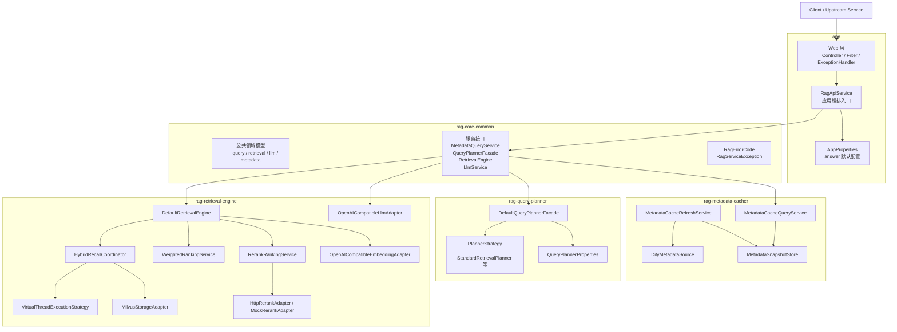
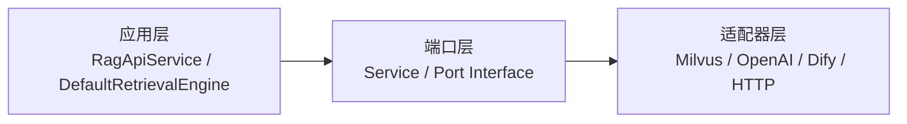
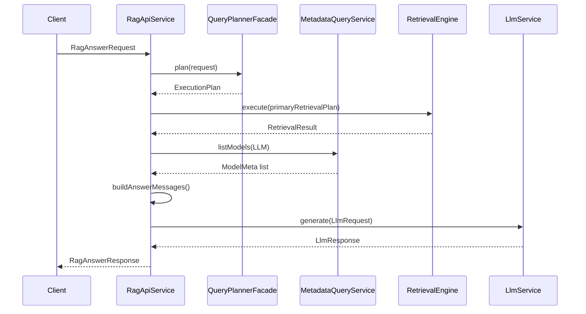
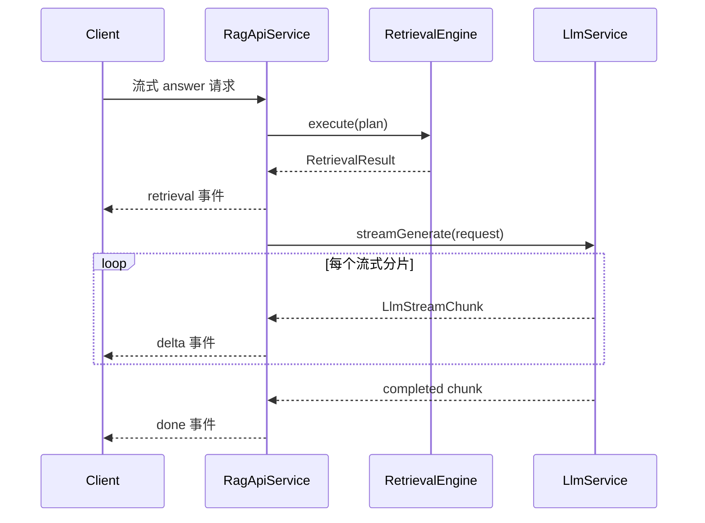
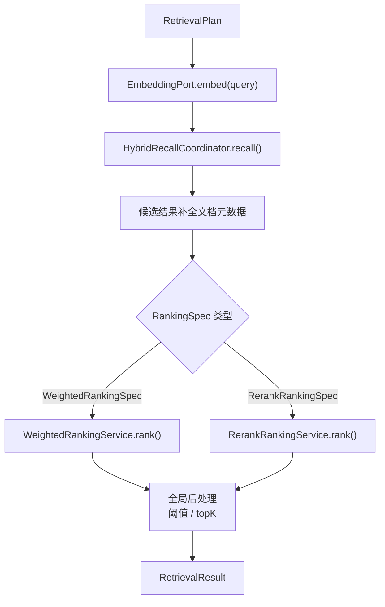
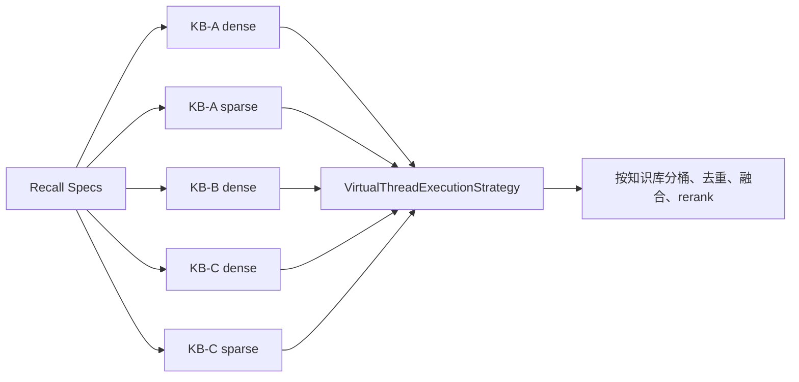
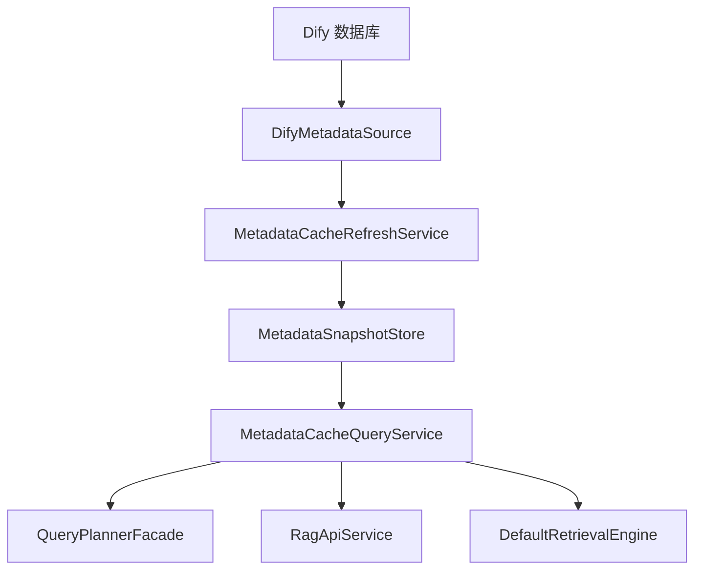
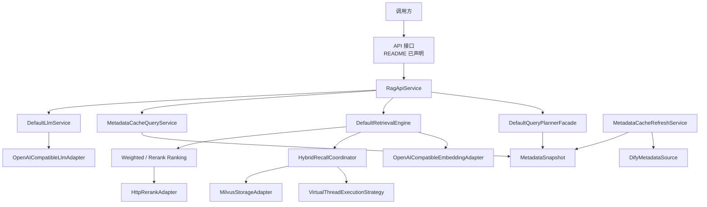

# rag-core-int 架构说明

## 1. 项目定位

`rag-core-int` 是一个基于 Java 25 和 Spring Boot 3 的 RAG 核心服务，目标是把“元数据管理、查询规划、检索执行、答案整理”拆成可组合的模块，并通过 `app` 模块统一装配成可运行应用。

当前仓库已经落地的核心能力包括：

- 元数据缓存与查询
- 检索计划生成
- 向量 / 稀疏混合召回
- weighted 与 rerank 两类排序
- 基于 OpenAI-compatible 协议的 LLM 生成与流式生成
- 应用服务层统一编排、日志跟踪与异常映射

根据 `README`，系统对外提供两类 API：

- `POST /api/v1/retrieval/search`
- `POST /api/v1/rag/answer`

其中 `answer` 支持同步返回和 SSE 流式返回。

需要注意：当前代码库中已经存在完整的应用服务、异常处理、日志过滤器和领域编排逻辑，但未看到实际的 Web Controller / 路由实现文件。因此本文档会同时区分：

- 当前代码中已经实现的运行时核心组件
- `README` 中声明的对外接口形态

## 2. 总体分层

整个项目是一个典型的“多模块 + 端口适配器”结构：

## 3. 模块划分

### 3.1 `rag-core-common`

这个模块是全项目的“公共协议层”，主要放：

- 领域模型：`ExecutionPlan`、`RetrievalPlan`、`RetrievalResult`、`LlmRequest`、`LlmResponse`、`ModelMeta` 等
- 对外服务接口：`MetadataQueryService`、`QueryPlannerFacade`、`RetrievalEngine`、`LlmService`
- 统一异常：`RagErrorCode`、`RagServiceException`

它的作用是把“上层编排”和“下层实现”解耦，避免 `app` 直接依赖某个具体基础设施实现。

### 3.2 `rag-metadata-cacher`

这个模块负责“把外部元数据系统拉平为本地快照”。

关键职责：

- 从 Dify 数据源加载知识库、文档、模型、标签绑定
- 构建 `MetadataSnapshot`
- 对外提供快照查询能力

关键组件：

- `MetadataCacheRefreshService`
  - 从 `MetadataSource` 拉全量元数据
  - 生成新版本快照
  - 写入 `MetadataSnapshotStore`
- `MetadataCacheQueryService`
  - 供上层查询模型、知识库、文档元数据
  - 按 `docIds` 过滤目标知识库
- `DifyMetadataSource`
  - 直接从 Dify 主库读取数据
  - 构造 `KnowledgeBaseMeta`、`DocumentMeta`、`ModelMeta`

### 3.3 `rag-query-planner`

这个模块负责把“用户问题”变成“可执行的检索计划”。

关键职责：

- 根据 `PlanType` 选择具体规划策略
- 生成 `ExecutionPlan`
- 在计划中确定：
  - 要查哪些知识库
  - 每个知识库用什么召回模式
  - 使用什么 embedding / rerank / 排序配置
  - 最终 topK 和阈值策略

关键组件：

- `DefaultQueryPlannerFacade`
  - 规划总入口
  - 根据 `PlanType` 派发到具体 `PlannerStrategy`
- `PlannerStrategy`
  - 规划策略扩展点
- `StandardRetrievalPlanner`
  - 当前主要的标准检索规划实现

### 3.4 `rag-retrieval-engine`

这个模块负责真正执行检索与排序，并提供 LLM 基础能力。

关键职责：

- query 向量化
- 知识库级并发召回
- dense / sparse 结果融合
- weighted 或 rerank 排序
- 最终返回 `RetrievalResult`
- 提供基于 OpenAI-compatible 协议的 LLM 生成能力

关键组件：

- `DefaultRetrievalEngine`
  - 检索主入口
- `HybridRecallCoordinator`
  - 混合召回协调器
  - 并行触发每个知识库的 dense / sparse 检索
- `VirtualThreadExecutionStrategy`
  - 使用虚拟线程执行并发召回任务
- `MilvusStorageAdapter`
  - 同时实现 dense 检索和 sparse 检索
- `OpenAICompatibleEmbeddingAdapter`
  - 生成 query embedding
- `RerankRankingService`
  - 负责请求级或单库级 rerank
- `WeightedRankingService`
  - weighted 兼容兜底排序
- `OpenAICompatibleLlmAdapter`
  - 对接 `/v1/chat/completions`
  - 支持同步和流式生成

### 3.5 `app`

这个模块是应用装配层，负责把前面几个模块组合起来，对外暴露服务能力。

关键职责：

- Spring Boot 启动
- 统一配置加载
- 应用服务编排
- 请求日志与 traceId
- 全局异常映射

关键组件：

- `RagCoreApplication`
  - 启动入口
- `RagApiService`
  - 整个 RAG 问答与检索的应用服务入口
- `AppProperties`
  - `answer` 默认配置，例如：
    - `default-llm-model-id`
    - `default-system-prompt`
    - `default-temperature`
    - `default-max-tokens`
- `TraceLoggingFilter`
  - 注入 `traceId`
  - 记录请求开始 / 结束日志
- `GlobalExceptionHandler`
  - 把业务异常转换为统一错误响应

## 4. 关键设计思想

### 4.1 端口与适配器

项目整体不是把所有逻辑都写在一个 Spring Service 里，而是分成三层：

- 公共接口层：定义能力边界
- 应用 / 领域层：编排流程
- 基础设施层：连接 Milvus、LLM、Dify、HTTP

这样做的好处是：

- 替换外部依赖更容易
- 测试更容易做 mock
- `app` 模块只关心“能力”，不关心“具体 SDK”

可以简化理解为：

### 4.2 计划驱动执行

系统先做规划，再执行检索，而不是直接在检索阶段临时判断所有细节。

也就是：

- `QueryPlannerFacade` 负责决定“该怎么查”
- `RetrievalEngine` 负责执行“已经决定好的方案”

这样检索引擎就可以保持职责纯粹，不再重复查询元数据或做业务分流判断。

### 4.3 应用层统一编排

`RagApiService` 处在很关键的位置，它并不负责底层算法，但负责把各阶段串起来：

- query -> plan
- plan -> retrieval
- retrieval -> llm request
- llm response -> api response

这使得问答链路的日志、容错、配置回退都能集中处理。

## 5. 问答主流程

`answer` 是当前项目最核心的业务流程。

### 5.1 同步问答流程

### 5.2 流式问答流程

当上游希望边生成边接收结果时，流程会变成：

### 5.3 `RagApiService` 的阶段拆分

`RagApiService` 中最重要的几个阶段是：

1. `planAnswer()`
   - 调用 `queryPlannerFacade.plan()`
   - 负责把规划异常包装成明确的业务错误
2. `executeRetrieval()`
   - 调用 `retrievalEngine.execute()`
   - 负责把召回异常转换为 `RETRIEVAL_FAILED`
3. `resolveLlmModel()`
   - 从元数据快照中选择要用的 LLM 模型
4. `buildAnswerMessages()`
   - 把系统提示词、用户问题、检索片段拼成消息
5. `generateAnswer()`
   - 调用 `llmService.generate()`
   - 把 LLM 调用错误包装成 `LLM_UNAVAILABLE`

### 5.4 问答阶段中 LLM 的角色

当前实现里，LLM 的定位比较清晰，不是“自由问答模型”，而是“基于召回内容整理答案的生成器”。

也就是说：

- 上游不直接控制模型参数
- 服务内部统一决定系统提示词和默认模型
- LLM 主要用于整理、压缩、组织和表达检索到的知识片段

当前默认配置已经支持：

- 默认模型 ID
- 默认系统提示词
- 默认 `temperature = 0.2`
- 默认 `maxTokens = 4096`

## 6. 检索主流程

### 6.1 检索执行总览

`DefaultRetrievalEngine` 的执行步骤基本固定：

### 6.2 并发召回策略

`HybridRecallCoordinator` 是检索阶段最关键的并发组件。

它的主要逻辑是：

- 遍历每个 `KnowledgeBaseRecallSpec`
- 为每个知识库创建 dense 召回任务
- 如果知识库模式是 `HYBRID`，再额外创建 sparse 召回任务
- 把所有任务交给 `ParallelExecutionStrategy`
- 当前默认实现是 `VirtualThreadExecutionStrategy`

并发模型如下：

### 6.3 dense / sparse 融合

在单库内部，当前处理方式是：

- dense 路先按向量分做阈值过滤和 topK 裁剪
- sparse 路只做 topK 裁剪
- 两路结果按 chunk 去重
- 归一化后按 `vectorWeight` 和 `keywordWeight` 计算融合分
- 如果该知识库启用了 rerank，再做单库 rerank

之后才会进入全局排序阶段。

### 6.4 排序策略

当前支持两类排序策略：

- `WeightedRankingSpec`
  - 兼容兜底方案
  - 适合没有全局 rerank 时使用
- `RerankRankingSpec`
  - 基于 rerank 模型的重排序
  - 可以结合全局阈值进一步过滤

### 6.5 候选结果增强

在排序前，`DefaultRetrievalEngine` 还会调用 `MetadataQueryService.getDocumentMetas()` 给候选块补充：

- `document_name`
- `upload_file_id`

因此返回给上层的 chunk 不只是内容和分数，也携带可用于展示或回溯的文档信息。

## 7. 元数据流程

元数据模块的目标是：把外部系统中的模型、知识库、文档信息，变成一个本地可快速查询的只读快照。

这个设计的好处是：

- 运行时查询速度快
- 规划和执行不必频繁访问外部数据库
- 模型与知识库配置可以统一在快照里管理

## 8. 外部依赖与基础设施

### 8.1 Dify

用途：

- 读取知识库元数据
- 读取文档元数据
- 读取模型配置
- 读取标签到业务域的绑定关系

对应适配器：

- `DifyMetadataSource`

### 8.2 Milvus

用途：

- dense 向量检索
- sparse / BM25 风格检索

对应适配器：

- `MilvusStorageAdapter`

当前实现中，Milvus 同时承担向量检索和稀疏检索，字段约定包括：

- dense 字段：`vector`
- sparse 字段：`sparse_vector`

### 8.3 OpenAI-compatible Embedding

用途：

- 将 query 编码为 dense 向量

对应适配器：

- `OpenAICompatibleEmbeddingAdapter`

### 8.4 OpenAI-compatible Chat Completions

用途：

- 同步答案生成
- 流式答案生成

对应适配器：

- `OpenAICompatibleLlmAdapter`

当前协议目标是：

- `POST /v1/chat/completions`

## 9. 配置体系

### 9.1 应用级配置

`app` 模块的 `AppProperties` 负责问答阶段的默认参数：

- `app.rag.answer.default-llm-model-id`
- `app.rag.answer.default-system-prompt`
- `app.rag.answer.default-temperature`
- `app.rag.answer.default-max-tokens`

这些值会在 `RagApiService.prepareAnswer()` 中注入到 `LlmRequest`。

### 9.2 模块级配置

各子模块还包含自己的配置类，例如：

- `QueryPlannerProperties`
- `MetadataCacherProperties`
- `MilvusProperties`

说明整个项目的配置并不是单点堆积，而是由各模块各自维护边界内的配置项。

## 10. 异常处理与可观测性

### 10.1 统一异常模型

目前已经引入统一的业务异常模型：

- `RagErrorCode`
- `RagServiceException`

目标是把错误归因到明确阶段，而不是仅返回笼统的 500。

例如：

- `INVALID_CONFIGURATION`
- `PLANNING_FAILED`
- `PLAN_UNSUPPORTED`
- `RETRIEVAL_FAILED`
- `LLM_UNAVAILABLE`
- `INTERNAL_ERROR`

### 10.2 异常映射

`GlobalExceptionHandler` 负责把异常转换为统一错误响应。

职责包括：

- 参数校验失败 -> 400
- 非法请求 -> 400
- 规划不支持 -> 400
- `RagServiceException` -> 按错误码映射 HTTP 状态
- 未知异常 -> 500

### 10.3 traceId 与日志

`TraceLoggingFilter` 会为每个请求生成或透传 `X-Trace-Id`，并：

- 在 MDC 中写入 `traceId`
- 写回响应头
- 记录请求进入与完成日志

这使得：

- Web 请求日志
- 业务日志
- 错误日志

可以围绕同一个 `traceId` 进行串联。

## 11. 当前实现中的关键组件关系

可以把整个项目浓缩为下面这张图：

## 12. 当前实现状态与注意事项

### 12.1 已经清晰实现的部分

- 多模块边界比较清晰
- 检索链路和问答链路职责明确
- 虚拟线程并发召回已经落地
- 应用服务层已经加入分阶段异常包装
- LLM 默认参数已支持配置化

### 12.2 需要特别注意的点

- 当前仓库中未看到实际的 Controller / 路由实现文件
  - 但 `README` 已声明对外 API 形态
  - 说明 Web 入口可能尚未提交、被裁剪，或后续补充
- `answer` 阶段已经限制了输出 `maxTokens`
  - 但这并不等于“输入上下文一定不会超长”
  - 如果召回片段过多，仍需要在消息拼接前做 prompt 裁剪策略
- 虚拟线程链路已经有更清晰的错误包装
  - 但 SSE 场景下的 MDC 透传和更细的可观测性仍可继续增强

## 13. 建议的后续演进方向

如果后续要继续完善，建议优先做下面几项：

1. 补齐实际的 Web Controller / SSE 入口实现，并与 `README` 保持一致
2. 在 `buildAnswerMessages()` 前增加上下文裁剪 / 预算控制
3. 为检索、规划、LLM 三阶段补充更完整的指标和 trace
4. 为部分失败场景提供更细粒度的降级说明
5. 为文档再补一份“时序 + 配置 + 错误码”专门手册

---

如果只看一句话，这个项目的核心架构可以概括为：

“先通过元数据快照确定可用资源，再通过查询规划生成检索方案，随后由检索引擎并发召回并排序，最后由应用服务把召回结果交给 LLM 整理成最终答案。”
